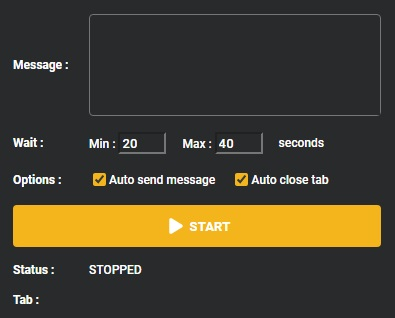
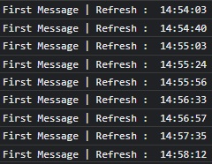
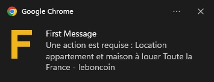

<h1 align="center">Welcome to First Message 👋</h1>

First Message is a chrome extension, used to send automatic message for each new item with specific research

Available on :

- [LEBONCOIN](https://www.leboncoin.fr/)

Language :

- French

## 💾 Install

Go to **chrome://extensions/**

Click on **Load unpacked** and select **First Message** folder

## ▶️ Usage

- Make a specific research (URL should start by https://www.leboncoin.fr/recherche...)
- Click on "**First Message**" Extension
- Click on **Start**
- Wait for new ads 😎🍸

### Options

**Message** : That is default message sended on a new item
If you keep message empty, that will send the default website message

**Wait** : That is is the time between each refreh, this value need to be randomized between a range (min and max)
Don't use tiny value, because you will refresh too many page in small amount of time, then website can ask you if you are bot

## 📜 Log

Chrome console log each refresh

## Notification

In case of something get wrong, extension send notification to catch your attention

## 👤 Author

**PANNETIER Alexis**

- Github: [@Alexis-Pannetier](https://github.com/Alexis-Pannetier)
